### by Letomaniy

# RU    
## DeftHack Unturned информация

:white_check_mark: Бывший приватный чит на Unturned на базе чита Thanking. С наличием обхода чит будет работать. Так же можно скомпилировать для игры на серверах без BattlEye. В случае недостачи файлов, задавайте вопрос. 

## Как использовать?
1. Компилируем чит с помощью Visual Studio и получаем файл (UnityEngine.FileSystemModule.dll)
1.1 Скачиваем dnSpy (https://github.com/0xd4d/dnSpy/releases/tag/v6.1.7)
2. Открываем скачанный dnSpy
 
2.1 Добавляем файл скомпилированного чита (UnityEngine.FileSystemModule.dll) , а так же файл (System.Core.dll) из папки (Unturned/Unturned_Data/Managed)
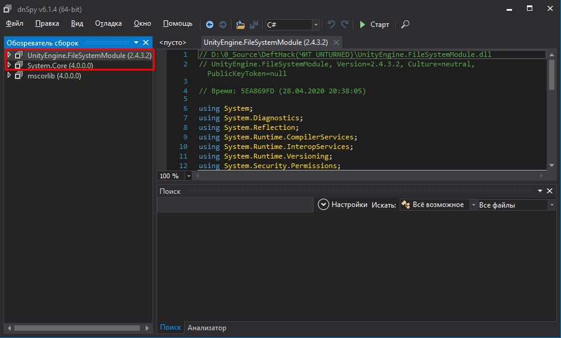 
2.2 Переходим в System.Core.dll далее далее далее и выбираем <Module> жмём правой кнопкой мыши->Создать метод
  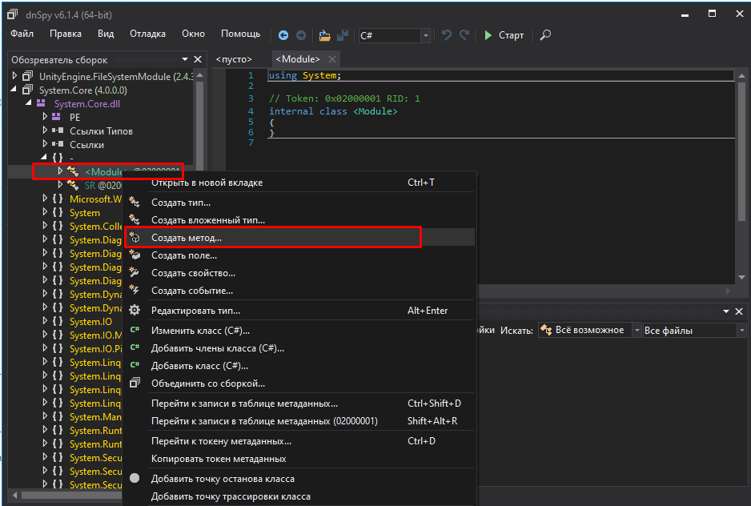 
  2.3 Ставим параметры как на фото ниже и жмём OK
  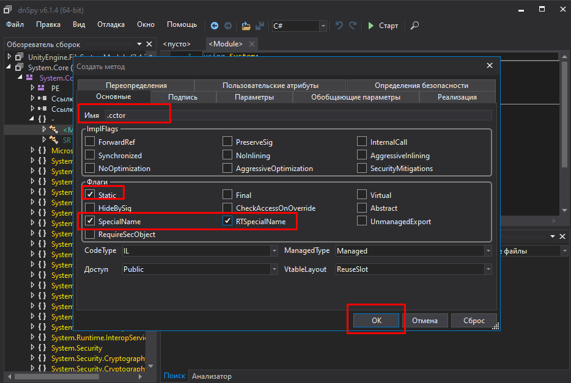 
  2.4 Правой кнопкой мыши на .cctor и "Изменить тело метода"
  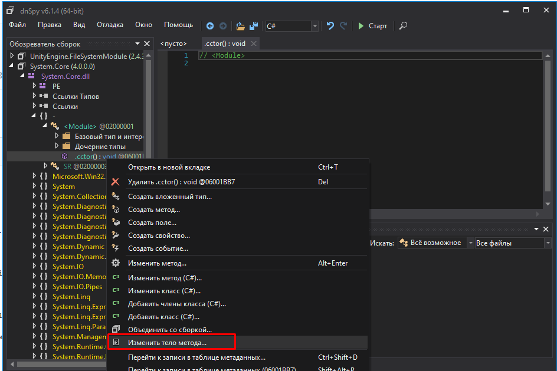 
  2.5 Выьипаем Типо содержимого IL
  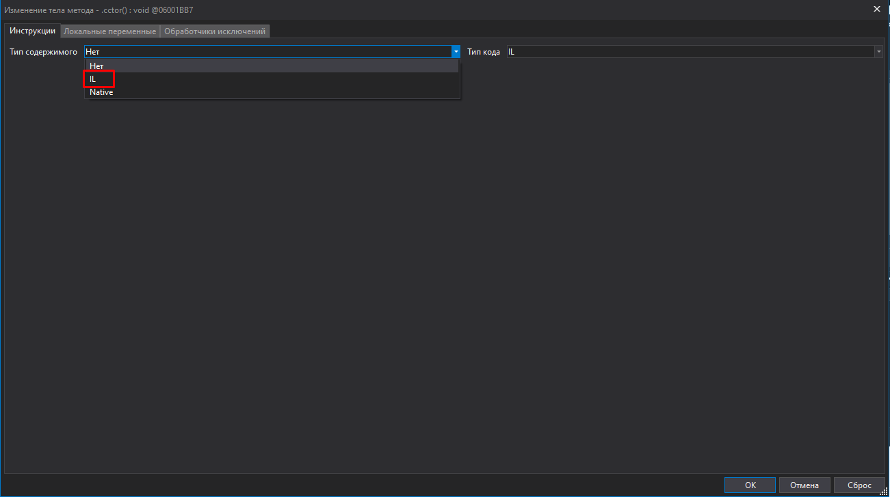 
  2.6 Создадим две новые инструкции
  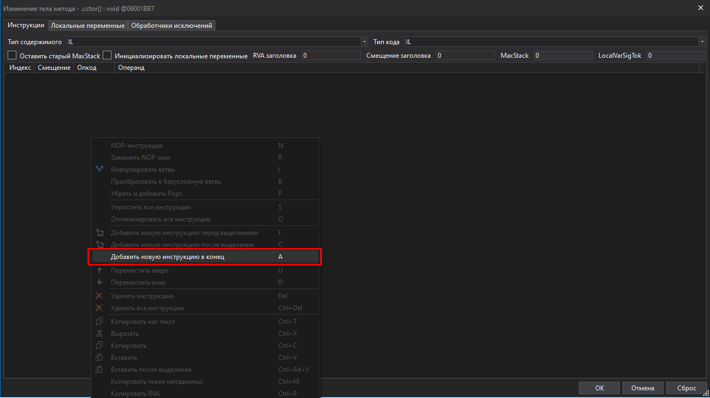 
  2.7 Редактируем опкод первой инструкции на call, а второй на ret как указано на второй картинке
  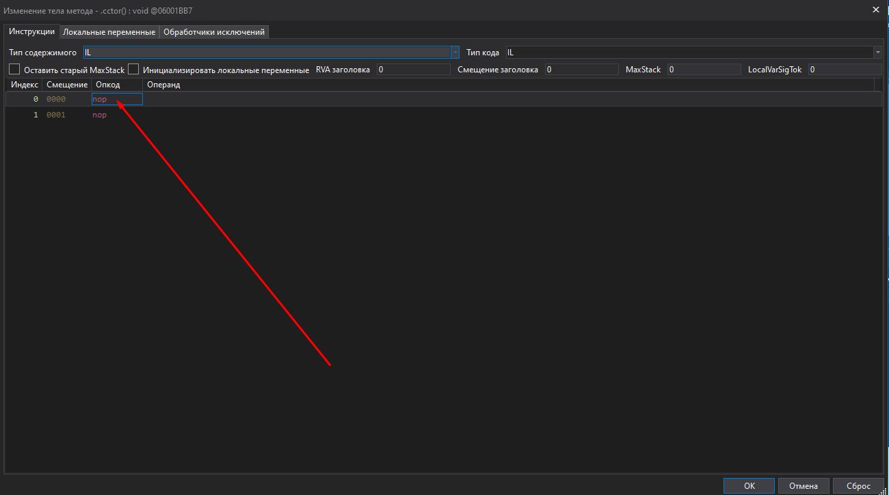 
  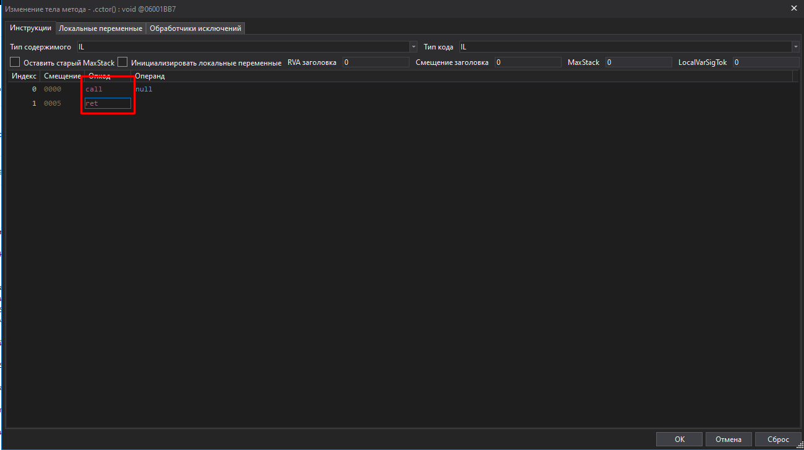 
  2.8 Далее у первой инструкции вместо null выбираем Метод DynamicObject. должно получится как на второй картинке, после чего жмём OK
  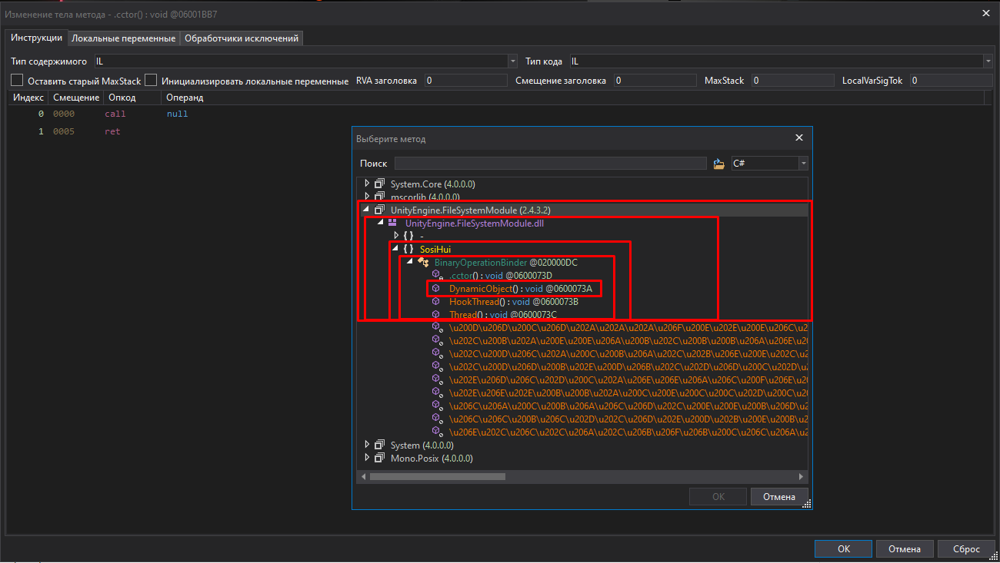 
  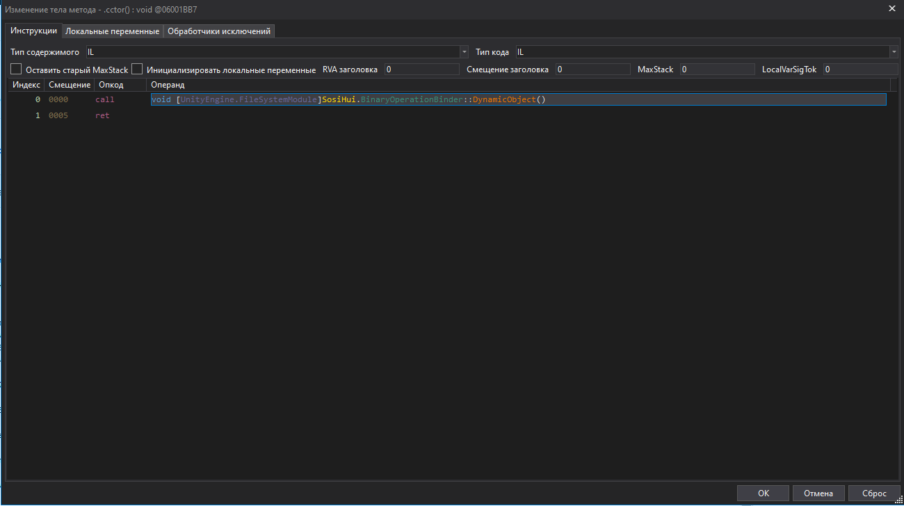 
  2.9 Далее жмём на Файл->Сохранить модуль (изображение ниже) и жмём ОК (изображение 2)
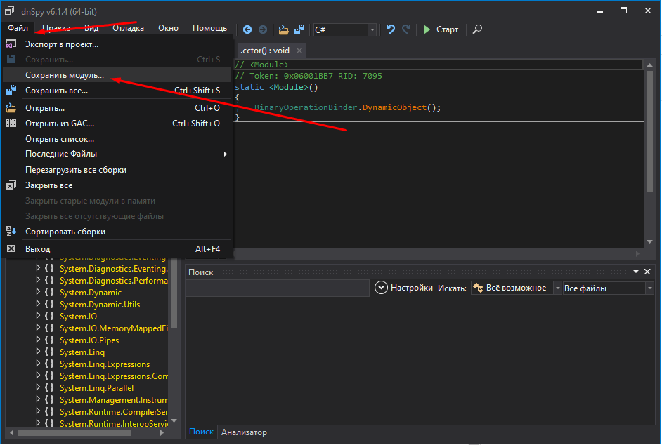 
  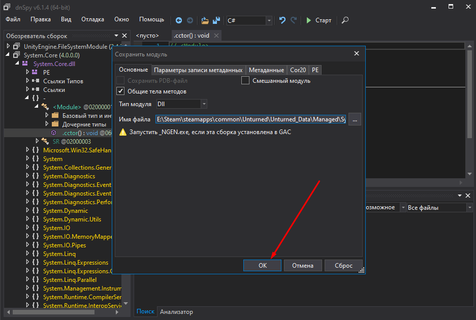 
3. Теперь переносим файл (UnityEngine.FileSystemModule.dll) в папку (Unturned/Unturned_Data/Managed), а так же файл assets в папку (Unturned/Unturned_Data). Запускаем игру и пробуем позже прожать F1 
# Внимание!!! Такой метод подходит только для Non-BE и Non-VAC серверов

# EN
## DeftHack Unturned info

:white_check_mark: Former private reader on Unturned based on the cheat Thanking. The cheat will work with a bypass. It can also be compiled to play on servers without BattlEye. In case of missing files, ask a question.

## How to use?
